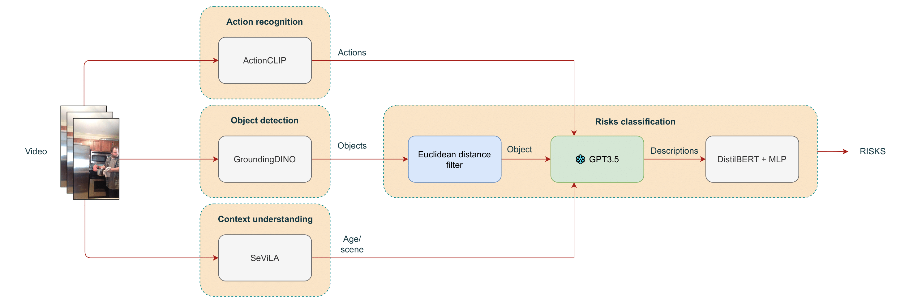

# Leveraging Video-language Model for Risks Assessment

* Author: [Javier Rodriguez-Juan](https://scholar.google.es/citations?user=z9qLOmwAAAAJ&hl=es&oi=ao)




This study proposes an open environment, multi-label risk classification framework that outputs possible risks based on an input video. The framework consists of an ensemble of models covering object detection, action recognition, context understanding and text classification tasks. Each model is evaluated separately in the context of home environments, with the overall framework performing well in each evaluation after fine tuning. The models were evaluated using a combination of several datasets, including Charades, ETRI-Activity3D, and custom video question answering and risk datasets. This study exploits the ability of large language models to interpret semantic visual features combined with textual input in order to understand the context in which the person is placed. The framework's ability to output multiple risks and its cross-domain capabilities make it a powerful tool that can enhance current risk management systems in a variety of scenarios, such as homes, construction sites and industry.

# Code structure

```bash
# Annotation and auxiliar code
./annotation_scripts

# Age,scene and actions evaluation using SeViLA
./evaluations

# Extraction of frames and ViT features
./features_extraction

# SeViLA implementation
./lavis

# Running scripts for SeViLA train and test
./run_scripts

# Grounding DINO implementation
./opengdino

# Risks classification model implementation
./risks_classification

# ActionCLIP implementation
./actionclip
```

# Setup

In order to ease the setup of the environment, a [docker image](https://hub.docker.com/r/javiro01/vlm-risks-assessment) with all dependencies install has been prepared. Remember download and place the weights of models in their respective directories. Next links to download models are provided and directories where models should be placed are indicated:
- SeViLA
  - Ckpt: [Link](https://github.com/Yui010206/SeViLA/tree/main)
  - Directory: `./sevila_checkpoints`
- Grounding DINO
  - Ckpt: [Link](https://github.com/longzw1997/Open-GroundingDino?tab=readme-ov-file)
  - Directory: `./opendino/weights`
- ActionCLIP
  - Ckpt: [Link](https://github.com/sallymmx/ActionCLIP)
  - Directory: `./actionclip/weights`
- Risks classification
  - Ckpt: [Link](https://huggingface.co/distilbert/distilbert-base-uncased)
  - Directory: `./risks_classification`

> Take in mind that for Grounding DINO a BERT model from HuggingFace must be also downloaded and place it under `./opengdino/weights`

# Training and inference

## Training
To train the framework, each of the submodules must be trained separately. In each of the directories corresponding to each submodule, you will find code that you can reuse to train models on your specific datasets. Consult the official submodule repositories for training instructions for each submodule.

## Inference
In order to test the framework you can use the next script
```bash
bash get_risks.sh /path/to/video /output/folder
```

Before running the script, make sure that your environment is configured correctly. You can check this by following the inference instructions of each of the submodules used in this framework, available in their official repositories.

# Acknowledgments
We would like to thank CIAICO/2022/132 Consolidated group project AI4Health funded by the Valencian government and International Center for Aging Research ICAR funded project IASISTEM This work has also been supported by a Valencian government grant for PhD studies, CIACIF/2022/175 and a research initiation grant from the University of Alicante, AII23-12. Also we would like to thanks the support of the University Institute for Computer Research at the UA.

Finally, we thank the developers of [SeViLA](https://github.com/Yui010206/SeViLA/tree/main), [GroundingDINO](https://github.com/longzw1997/Open-GroundingDino?tab=readme-ov-file) and [ActionCLIP](https://github.com/sallymmx/ActionCLIP) for their public code release, which were the foundations to make this work possible. 
